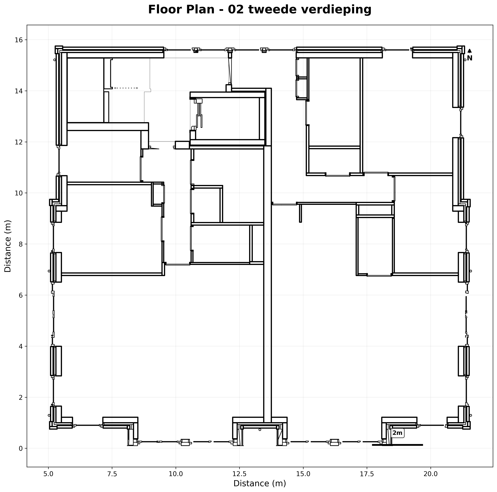

# IFC Floor Plan Extractor

[](https://www.python.org/downloads/)
[](https://opensource.org/licenses/MIT)

> Extract geometric data (CSV/WKT) and 2D floor plans from IFC building models

## Features

📊 **Export geometric data** as WKT/CSV  
✨ **Professional floor plan images** with architectural styling  
🎨 **Multiple visual styles** (professional, minimal, colorful, technical)  
⚡ **Batch processing** for multiple IFC files  
🔧 **Robust geometry engine** using Trimesh + Shapely  

## Quick Start

```bash
# Install dependencies
pip install -r requirements.txt

# Extract geometric data as CSV/WKT
python extract_floor_plans.py building.ifc

# Also generate professional floor plan images
python extract_floor_plans.py building.ifc --formatter image wkt --style professional
```

## Installation

**Requirements:** Python 3.8+

```bash
git clone https://github.com/yourusername/ifc-floor-plan-extractor.git
cd ifc-floor-plan-extractor
pip install -r requirements.txt
```

## Usage

```bash
# Basic usage
python extract_floor_plans.py input.ifc

# Multiple outputs and styling
python extract_floor_plans.py building.ifc \
  --output ./plans \
  --formatter image wkt \
  --style professional \
  --width 4096

# Batch process multiple files
python extract_floor_plans.py "buildings/*.ifc" --output ./all_plans
```

### Command Line Options

| Option | Description | Default |
|--------|-------------|---------|
| `--output` | Output directory | `output` |
| `--formatter` | Output format: `image`, `wkt` | `wkt` |
| `--style` | Visual style | `professional` |
| `--width/--height` | Image dimensions | `2048` |
| `--max-elements` | Limit for large files | `None` |

## Output Structure

```
output/
└── building_name/
    ├── Level_1_floor_plan.png    # Floor plan image
    ├── Level_1_floor_plan.csv    # Geometric data (WKT)
    └── Level_2_floor_plan.png
    ... 
```

## Examples

<details>
<summary>📸 View example outputs</summary>

### Professional Style


### Technical Style (Line drawings)


</details>

## Troubleshooting

**No floor plans generated?**
- Ensure your IFC file contains `IfcBuildingStorey` elements
- Try `--max-elements 100` for testing large files

**Memory issues?**
- Use `--max-elements` to limit processing
- Process files individually instead of batch

## License

MIT License - see [LICENSE](LICENSE) file for details.

---

**Built with:** [IfcOpenShell](https://ifcopenshell.org/) • [Trimesh](https://trimsh.org/) • [Shapely](https://shapely.readthedocs.io/)